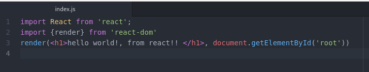
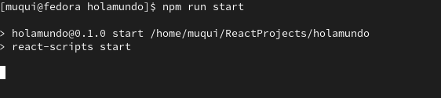
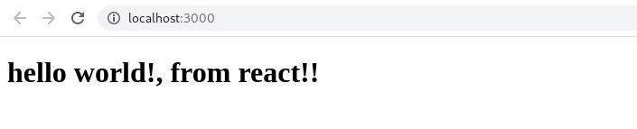

# React-Hello-World
<h1>Requirements</h1>
<ul>
  <li>Node.js</li>
  <li>Knowledge in Html, css an JavaScript</li>
</ul>
<h3>Steps for creating React Hello Word.</h3>

1) Go to terminal and create project

 npx create-react-app holamundo

this command will create folder ready to development.

delete content folder /src inside holamundo folder. We will to start from scratch. 

Create js file named index.js  in /src folder.

Start server type on terminal

You will see below screen

